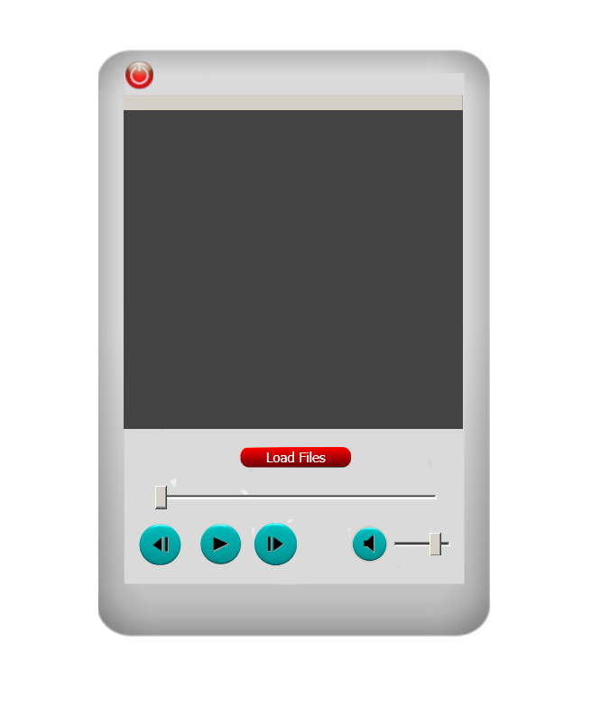

# AudioPlayer 1.0v

This is a small WPF app utitlizing winmm.dll.
Full descrption can be found here https://docs.microsoft.com/en-us/windows/win32/multimedia/multimedia-reference.

## OS
Windows

## IDE
Visual Studio 2017

## Audio Format
WAV

## TODO
* Decorate sliders.
* Implement playing next song after the current one stops playing.
* Add MP3 support, currently it can play MP3's with quality up to 192 bps.
  Note that mp3 selection from dialog is disabled.
* Implement a jump of the progress slider to a position of the mouse click.
  
## Binary Download
<a id="raw-url" href="https://github.com/KamilPiekutowski/AudioPlayer/tree/master/AudioPlayer/bin/Debug/AudioPlayer.exe">AudioPlayer.exe</a>

